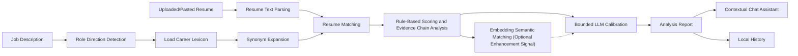

<p align="center">
  
</p>

<h1 align="center">BiasBreaker Career</h1>

<p align="center"><em>AI anti-bullying career assistant for algorithmically disadvantaged job seekers</em></p>

<p align="center">[中文](README.md) · [English](README.en.md)</p>

BiasBreaker Career is an **AI anti-bullying career assistant for algorithmically disadvantaged job seekers**. It is not a generic resume polishing tool. It helps students, career switchers, candidates from less privileged backgrounds, and applicants whose experience is easy to misread understand how recruiting systems may parse their resumes, then translate real experience into job-relevant language that ATS tools and human reviewers can recognize more fairly.

As recruiting workflows increasingly rely on keyword search, automated screening, and model-based ranking, many candidates are not rejected because they lack ability. They are rejected because they do not know what the algorithm is looking for. BiasBreaker Career turns this opaque screening pressure into an explainable and actionable evidence chain: users provide a target job description and a resume, then the system analyzes role fit, ATS readability, evidence strength, and expression structure. A contextual chat assistant inside the report modal helps users ask follow-up questions such as "What should I fix first?", "How should I rewrite this project?", and "How can I explain this in an interview?"

The project does not replace recruiters, promise screening results, or encourage fake optimization for algorithms. Its goal is to help job seekers identify potential algorithmic misreads, expression bias, and information asymmetry, then present their authentic experience in a fairer and more legible way.

## Core Capabilities

- **Risk explanation for algorithmically disadvantaged candidates**: Turns questions like "Why did my application get no response?" or "Why was my relevant experience ignored?" into concrete keyword, structure, and evidence issues.
- **JD-driven role direction detection**: Identifies the closest career direction from the job title, job description keywords, and capability requirements, reducing passive penalties caused by unfamiliar role language.
- **Lightweight Chinese campus recruiting capability lexicon**: Includes common early-career directions such as operations, product, engineering, data, marketing, HR, design, research, and consulting. The taxonomy is inspired by O*NET, ESCO, and the Occupational Classification of the People's Republic of China.
- **Synonym expansion and keyword coverage analysis**: Maps job requirements to lexicon entries and equivalent expressions, reducing false negatives caused by purely literal matching.
- **Evidence-chain scoring**: Checks whether the resume supports claims with projects, actions, methods, objects, outcomes, and metrics instead of only stacking keywords.
- **LLM calibration with rule-based fallback**: Uses an LLM to calibrate rule-based results within bounded score deltas. If the model is unavailable, the system still returns a rule-based report.
- **Semantic matching signals**: Uses an embedding model when available to compare the job description with resume chunks and surface strong or weak evidence.
- **Contextual report chat assistant**: Adds a right-side chat panel inside the analysis report modal. The assistant answers based on the current job description, resume text, and report.
- **Local history management**: Stores reports in browser localStorage for later viewing, filtering, deletion, and Markdown export.

## Quick Start

This project is a single Next.js application. Server-side capabilities are implemented with Next.js API Routes.

```powershell
cd C:\Files\Study\Codes\Contest\Zhilian-Zhaopin-AI-Contest\BiasBreaker-Career
npm install
Copy-Item .env.example .env.local
npm run dev
```

Then open:

```text
http://localhost:3000
```

The app can run without model API keys. If LLM or embedding configuration is missing, the system falls back to the built-in rule-based analysis logic.

## Environment Variables

Copy `.env.example` to `.env.local` and fill in the variables you need:

| Variable | Purpose |
| --- | --- |
| `DEFAULT_LLM_PROVIDER` | LLM provider identifier. The example default is `mimo` |
| `DEFAULT_LLM_MODEL` | Chat model used for resume analysis and report Q&A |
| `MIMO_API_KEY` | LLM API key |
| `MIMO_BASE_URL` | OpenAI-compatible LLM endpoint |
| `DEFAULT_EMBEDDING_PROVIDER` | Embedding provider identifier. The example default is `hunyuan` |
| `DEFAULT_EMBEDDING_MODEL` | Embedding model used for semantic matching |
| `HUNYUAN_API_KEY` | Embedding API key |
| `HUNYUAN_BASE_URL` | OpenAI-compatible embedding endpoint |
| `MODEL_TIMEOUT_SECONDS` | LLM request timeout |
| `EMBEDDING_TIMEOUT_SECONDS` | Embedding request timeout |
| `PDFTOTEXT_PATH` | Optional path to an external `pdftotext` executable for better PDF extraction |

## User Flow

1. Open the homepage and start an analysis.
2. Enter the target job title and job description.
3. Upload a PDF, DOCX, TXT, or MD resume, or paste resume text directly.
4. Run the analysis. The system returns scores, risk explanations, a dimension radar chart, prioritized issues, and sentence-level rewrite suggestions.
5. Use the right-side report chat assistant for follow-up questions.
6. Open the history page to review past reports or export a report as Markdown.

## Analysis Flow



Note: `Rule-Based Scoring and Evidence Chain Analysis -> Bounded LLM Calibration` is the main path because the rule engine first creates a stable baseline report. `Embedding Semantic Matching` is an enhancement signal that helps the LLM compare the job description with resume chunks. This is intentional: embedding may fail when API keys are missing, requests time out, or the model is unavailable. In that case, the system can still return a report using rule-based analysis and LLM calibration. When embedding is available, semantic matching is passed to the LLM as additional context.

## Anti-Bullying Analysis Dimensions

The system currently breaks down algorithmic screening risk through four dimensions:

| Dimension | What It Checks |
| --- | --- |
| Keyword Coverage | Whether the resume covers important skills, tools, business terms, and role capabilities from the JD, reducing false negatives caused by different wording |
| Structure Clarity | Whether sections, project descriptions, timelines, and information hierarchy are easy for ATS tools and reviewers to read |
| Evidence Strength | Whether ability claims are supported by actions, methods, objects, outcomes, and metrics, so non-standard backgrounds can still prove capability through evidence |
| System Readability | Whether decorative formatting, messy structure, or missing key information may cause ATS parsing risk |

The total score is not a simple keyword hit rate. It combines the career lexicon, synonym expansion, risk markers, evidence-chain analysis, and semantic matching signals.

## Project Structure

```text
BiasBreaker-Career/
├── app/
│   ├── api/
│   │   ├── analyze/          # Resume analysis API
│   │   ├── chat/             # Report chat assistant API
│   │   └── parse-resume/     # PDF/DOCX/TXT/MD resume parsing API
│   ├── analyze/              # Resume analysis page
│   ├── history/              # History page
│   ├── page.tsx              # Homepage
│   └── globals.css           # Global styles
├── components/
│   ├── AnalysisResultModal.tsx   # Analysis report modal
│   ├── ResumeChatAssistant.tsx   # Right-side contextual chat assistant
│   ├── DimensionRadar.tsx        # Dimension radar chart
│   └── AppNav.tsx                # App navigation
├── data/
│   ├── career-lexicon.json       # Base career capability lexicon
│   ├── career-lexicon-extra.json # Extended lexicon
│   └── career-lexicon-extra-2.json
├── lib/
│   ├── analysis.ts           # Rule scoring, risk detection, suggestion generation
│   ├── lexicon.ts            # Lexicon loading, direction detection, synonym expansion
│   ├── llm-analysis.ts       # LLM calibration
│   ├── semantic-analysis.ts  # Embedding semantic matching
│   ├── model-provider.ts     # OpenAI-compatible model adapter
│   └── history.ts            # Browser local history
├── docs/                     # Product docs and contest materials
├── package.json
└── README.md
```

## Main APIs

### `POST /api/parse-resume`

Parses an uploaded resume file.

Supported formats:

- PDF
- DOCX
- TXT
- MD

The response includes the file name, file size, and extracted text. PDF parsing first tries external `pdftotext`, then falls back to `pdfjs-dist`.

### `POST /api/analyze`

Generates the resume analysis report.

Core request fields:

```json
{
  "jobTitle": "Backend Software Development",
  "jdText": "Job description text",
  "resumeText": "Resume text"
}
```

Processing steps:

1. Validate the job description and resume text.
2. Normalize the job title and input text.
3. Try to generate semantic matching signals.
4. Try bounded LLM calibration.
5. If model calls fail, return the rule-based report.

### `POST /api/chat`

Powers the right-side report chat assistant.

Core request fields:

```json
{
  "jobTitle": "Target role",
  "jdText": "Job description text",
  "resumeText": "Resume text",
  "resumeFileName": "resume.pdf",
  "analysisResult": {},
  "messages": [
    { "role": "user", "content": "What should I fix first?" }
  ]
}
```

The assistant only answers based on the current JD, resume, and analysis report. It does not invent experience, certificates, schools, companies, or project outcomes. If the model is unavailable, it falls back to report findings, suggestions, and review scripts.

## Local History and Privacy

History records are stored in browser `localStorage` under:

```text
biasbreaker-career-history
```

Each record contains:

- Analysis report
- Inferred candidate name
- Target role
- Analysis timestamp
- Original job description text
- Original resume text
- Resume file name

The job description and resume text are used as hidden context for the chat assistant in historical reports. They are not displayed directly in the report modal. The current project has no database and no separate backend service. For a public deployment, user consent, encryption, deletion controls, and a server-side data strategy should be added.

## Tech Stack

- **Framework**: Next.js 15 App Router
- **Language**: TypeScript
- **UI**: React 19, Tailwind CSS v4, Framer Motion
- **File parsing**: `mammoth`, `pdfjs-dist`, optional external `pdftotext`
- **Model interface**: OpenAI-compatible Chat Completions and Embeddings
- **Storage**: Browser localStorage

## Development Commands

```powershell
npm run dev      # Start the development server
npm run build    # Production build
npm run lint     # Run ESLint
```

## FAQ

### 1. Can I try it without model API keys?

Yes. If LLM or embedding configuration is missing, the system falls back to the rule engine in `lib/analysis.ts`.

### 2. What if PDF parsing quality is poor?

Scanned or encrypted PDFs may not provide extractable text. Use a copyable PDF, DOCX, TXT, or MD file. You can also install Poppler and set `PDFTOTEXT_PATH` to improve PDF text extraction.

### 3. Why does `npm run dev` or `npm run build` seem to take a long time?

The Next.js development server is meant to keep running. It does not exit automatically. On Windows, if `.next/trace` is locked or the port is occupied, stop project-related Node processes and clear the cache:

```powershell
Get-CimInstance Win32_Process |
  Where-Object { $_.Name -match '^node(\.exe)?$' -and $_.CommandLine -like '*BiasBreaker-Career*' } |
  ForEach-Object { Stop-Process -Id $_.ProcessId -Force }

Remove-Item -LiteralPath .next -Recurse -Force -ErrorAction SilentlyContinue
npm run dev
```

### 4. Why is the chat assistant conservative?

This is intentional. The assistant is instructed not to invent experience, data, certificates, or project outcomes. When evidence is missing, it should say that the current resume does not show it and suggest truthful ways to add or verify evidence.

## Suitable Use Cases

- Students facing ATS, keyword screening, and unfamiliar role language for the first time.
- Career switchers or candidates with non-standard backgrounds who need to translate existing experience into role-recognizable evidence.
- Candidates from less privileged backgrounds or with limited career coaching support who need an assistant that explains screening logic.
- Pre-application checks for keyword gaps, weak evidence, unclear structure, and ATS readability risk.
- Interview preparation that turns report risks into explanation scripts.
- Comparing how the same resume matches different role directions.

## Design Boundaries

- This project does not promise success in ATS screening, written tests, interviews, or human review.
- It opposes fake experience, keyword stuffing, and exaggerated outcomes intended to deceive algorithms.
- Scores only represent matching, expression, and system-readability risks between the current JD and resume text.
- Suggestions should be grounded in real user experience. The project does not encourage fabricated projects, metrics, or certificates.
- Browser localStorage is not a production-grade multi-user data storage strategy.

## Related Documents

- `docs/BiasBreaker_Career_产品设计文档.md`: Product design and feature description.
- `docs/智联招聘AI创新大赛参赛资料.docx`: Contest materials.
- `docs/superpowers/`: Implementation plans and development records.
