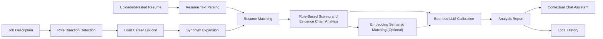

<p align="center">
  
</p>

<h1 align="center">BiasBreaker Career</h1>

<p align="center"><em>AI anti-bullying career assistant for algorithmically disadvantaged job seekers</em></p>

<p align="center">
  <a href="README.md">中文</a>
  ·
  <a href="README.en.md">English</a>
</p>

BiasBreaker Career is an **AI anti-bullying career assistant for algorithmically disadvantaged job seekers**. It is not a generic resume polishing tool. It helps students, career switchers, candidates from less privileged backgrounds, and applicants whose experience is easy to misread understand how recruiting systems may parse their resumes, then translate real experience into job-relevant language that ATS tools and human reviewers can recognize more fairly.

As recruiting workflows increasingly rely on keyword search, automated screening, and model-based ranking, many candidates are not rejected because they lack ability. They are rejected because they do not know what the algorithm is looking for. BiasBreaker Career turns this opaque screening pressure into an explainable and actionable evidence chain: users provide a target job description and a resume, then the system analyzes keyword coverage, structure clarity, experience evidence, and system readability. A contextual chat assistant inside the report modal helps users ask follow-up questions such as "What should I fix first?", "How should I rewrite this project?", and "How can I explain this in an interview?"

The project does not replace recruiters, promise screening results, or encourage fake optimization for algorithms. Its goal is to help job seekers identify potential algorithmic misreads, expression bias, and information asymmetry, then present their authentic experience in a fairer and more legible way.

## Core Capabilities

- **Risk explanation for algorithmically disadvantaged candidates**: Turns questions like "Why did my application get no response?" or "Why was my relevant experience ignored?" into concrete keyword, structure, and evidence issues.
- **JD-driven role direction detection**: Identifies the closest career direction from the job title, job description keywords, and capability requirements, reducing passive penalties caused by unfamiliar role language.
- **Lightweight Chinese campus recruiting capability lexicon**: Includes common early-career directions such as operations, product, engineering, data, marketing, HR, design, research, and consulting. The taxonomy is inspired by O*NET, ESCO, and the Occupational Classification of the People's Republic of China.
- **Synonym expansion and keyword coverage analysis**: Maps job requirements to lexicon entries and equivalent expressions, reducing false negatives caused by purely literal matching.
- **Evidence-chain scoring**: Checks whether the resume supports claims with projects, actions, methods, objects, outcomes, and metrics instead of only stacking keywords.
- **LLM calibration with rule-based fallback**: Uses an LLM to calibrate rule-based results within bounded score deltas. If the model is unavailable, the system still returns a rule-based report.
- **Semantic matching signals**: Uses an embedding model when available to compare the job description with resume chunks and surface strong or weak evidence.
- **Browser-side PDF parsing**: Parses PDF files locally in the browser with a MuPDF Worker; DOCX, TXT, and MD files are parsed through the server API.
- **Contextual report chat assistant**: Adds a right-side chat panel inside the analysis report modal. The assistant answers based on the current job description, resume text, and report.
- **Local history management**: Stores reports in browser localStorage for later viewing, filtering, deletion, and Markdown export.
- **Optional standalone backend**: Next.js API Routes can run the analysis directly, or forward analysis and chat requests to a Fastify backend through `BACKEND_API_BASE_URL` for long-running model calls and queue control.

## Quick Start

The project uses npm workspaces. The frontend is a Next.js 15 App Router app, and the backend is an optional Fastify service.

```powershell
cd C:\Files\Study\Codes\Contest\Zhilian-Zhaopin-AI-Contest\BiasBreaker-Career
npm install
Copy-Item .env.example frontend\.env.local
npm run frontend:dev
```

Then open:

```text
http://localhost:3000
```

The app can run without model API keys. If LLM or embedding configuration is missing, the system falls back to the built-in rule-based analysis logic.

### Enable the Standalone Backend

By default, the frontend's Next.js API Routes run the analysis directly. To forward analysis and chat requests to the standalone Fastify backend, open two terminals:

```powershell
# Terminal 1: start the backend, default http://127.0.0.1:3001
Copy-Item backend\.env.example backend\.env
npm run backend:start
```

```powershell
# Terminal 2: start the frontend
Copy-Item .env.example frontend\.env.local
Add-Content frontend\.env.local "BACKEND_API_BASE_URL=http://127.0.0.1:3001"
npm run frontend:dev
```

After `BACKEND_API_BASE_URL` is configured, frontend `/api/analyze` and `/api/chat` requests are redirected to the corresponding backend endpoints with HTTP 307.

## Environment Variables

For frontend local development, copy the root `.env.example` to `frontend/.env.local`. For standalone backend deployment, copy `backend/.env.example` to `backend/.env`.

| Variable | Used By | Purpose |
| --- | --- | --- |
| `DEFAULT_LLM_PROVIDER` | Frontend / Backend | LLM provider identifier. The example default is `mimo` |
| `DEFAULT_LLM_MODEL` | Frontend / Backend | Chat model used for resume analysis and report Q&A |
| `MIMO_API_KEY` | Frontend / Backend | LLM API key |
| `MIMO_BASE_URL` | Frontend / Backend | OpenAI-compatible LLM endpoint. It may be a base URL, `/v1`, or `/chat/completions` |
| `DEFAULT_EMBEDDING_PROVIDER` | Frontend / Backend | Embedding provider identifier. The example default is `hunyuan` |
| `DEFAULT_EMBEDDING_MODEL` | Frontend / Backend | Embedding model used for semantic matching |
| `HUNYUAN_API_KEY` | Frontend / Backend | Embedding API key |
| `HUNYUAN_BASE_URL` | Frontend / Backend | OpenAI-compatible embedding endpoint. It may be a base URL, `/v1`, or `/embeddings` |
| `MODEL_TIMEOUT_SECONDS` | Frontend / Backend | LLM request timeout |
| `EMBEDDING_TIMEOUT_SECONDS` | Frontend / Backend | Embedding request timeout |
| `BACKEND_API_BASE_URL` | Frontend | Optional. Forwards analysis and chat APIs to the standalone backend |
| `HOST` | Backend | Fastify host, defaults to `127.0.0.1` |
| `PORT` | Backend | Fastify port, defaults to `3001` |
| `ALLOWED_ORIGINS` | Backend | Comma-separated CORS allowlist |
| `MAX_CONCURRENT_JOBS` | Backend | Maximum number of concurrent async analysis jobs |

## User Flow

1. Open the homepage and start an analysis.
2. Enter the target job title and job description.
3. Upload a PDF, DOCX, TXT, or MD resume, or paste resume text directly.
4. Run the analysis. The system parses the resume, then returns scores, risk explanations, a dimension radar chart, prioritized issues, and sentence-level rewrite suggestions.
5. Use the right-side report chat assistant for follow-up questions.
6. Open the history page to review past reports, search by candidate or role, filter by risk level, batch delete, or export reports as Markdown.

## Analysis Flow



Note: `Rule-Based Scoring and Evidence Chain Analysis -> Bounded LLM Calibration` is the main path because the rule engine first creates a stable baseline report. `Embedding Semantic Matching` is an enhancement signal that helps the LLM compare the job description with resume chunks. This is intentional: embedding may fail when API keys are missing, requests time out, or the model is unavailable. In that case, the system can still return a report using rule-based analysis and LLM calibration. When embedding is available, semantic matching is passed to the LLM as additional context.

## Anti-Bullying Analysis Dimensions

The system currently breaks down algorithmic screening risk through four dimensions:

| Dimension | What It Checks |
| --- | --- |
| Keyword Coverage | Whether the resume covers important skills, tools, business terms, and role capabilities from the JD, reducing false negatives caused by different wording |
| Structure Clarity | Whether sections, project descriptions, timelines, and information hierarchy are easy for ATS tools and reviewers to read |
| Evidence Strength | Whether ability claims are supported by actions, methods, objects, outcomes, and metrics, so non-standard backgrounds can still prove capability through evidence |
| System Readability | Whether decorative formatting, messy structure, or missing key information may cause ATS parsing risk |

The total score is not a simple keyword hit rate. It combines the career lexicon, synonym expansion, risk markers, evidence-chain analysis, and semantic matching signals.

## Project Structure

```text
BiasBreaker-Career/
├── frontend/                         # Next.js frontend and default API Routes
│   ├── app/
│   │   ├── api/
│   │   │   ├── analyze/              # Resume analysis API, can forward to standalone backend
│   │   │   ├── chat/                 # Report chat assistant API, can forward to standalone backend
│   │   │   └── parse-resume/         # DOCX/TXT/MD resume parsing API
│   │   ├── analyze/                  # Resume analysis page
│   │   ├── history/                  # History page
│   │   ├── page.tsx                  # Homepage
│   │   └── globals.css               # Global styles
│   ├── components/
│   │   ├── AnalysisResultModal.tsx   # Analysis report modal
│   │   ├── ResumeChatAssistant.tsx   # Right-side contextual chat assistant
│   │   ├── DimensionRadar.tsx        # Dimension radar chart
│   │   └── AppNav.tsx                # App navigation
│   ├── data/                         # Career capability lexicons
│   ├── lib/
│   │   ├── analysis.ts               # Rule scoring, risk detection, suggestion generation
│   │   ├── lexicon.ts                # Lexicon loading, direction detection, synonym expansion
│   │   ├── llm-analysis.ts           # LLM calibration
│   │   ├── semantic-analysis.ts      # Embedding semantic matching
│   │   ├── model-provider.ts         # OpenAI-compatible model adapter
│   │   ├── history.ts                # Browser local history
│   │   └── pdf/parsePdfInBrowser.ts  # Browser MuPDF parsing entry
│   └── workers/mupdf-parser.worker.ts
├── backend/
│   ├── index.ts                      # Optional Fastify analysis backend
│   ├── ecosystem.config.cjs          # PM2 deployment config
│   └── package.json
├── docs/                             # Product docs and contest materials
├── package.json                      # npm workspaces and root scripts
├── package-lock.json
└── README.md
```

## Main APIs

### `POST /api/parse-resume`

Parses uploaded DOCX, TXT, or MD resume files.

PDF files do not use this endpoint. They are parsed locally in the browser through a MuPDF Worker, which reduces the need to upload the original PDF file to the server and avoids some server-side PDF parsing dependency issues.

### `POST /api/analyze`

Generates the resume analysis report.

Core request fields:

```json
{
  "jobTitle": "Backend Software Development",
  "jdText": "Job description text",
  "resumeText": "Resume text",
  "resumeFileName": "resume.pdf"
}
```

Processing steps:

1. Validate the job description and resume text.
2. Normalize the job title and input text.
3. Try to generate semantic matching signals.
4. Try bounded LLM calibration.
5. If model calls fail, return the rule-based report.

### `POST /api/chat`

Powers the right-side report chat assistant.

Core request fields:

```json
{
  "jobTitle": "Target role",
  "jdText": "Job description text",
  "resumeText": "Resume text",
  "resumeFileName": "resume.pdf",
  "analysisResult": {},
  "messages": [
    { "role": "user", "content": "What should I fix first?" }
  ]
}
```

The assistant only answers based on the current JD, resume, and analysis report. It does not invent experience, certificates, schools, companies, or project outcomes. If the model is unavailable, it falls back to report findings, suggestions, and review scripts.

### Additional Standalone Backend APIs

Besides the synchronous analysis endpoint, the Fastify backend also provides async job APIs for long-running model calls:

- `GET /health`: Check service status, queue length, and current concurrency.
- `POST /api/analysis-jobs`: Create an async analysis job.
- `GET /api/analysis-jobs/:jobId`: Query job status and result.

The current frontend calls the synchronous `/api/analyze` endpoint by default. The async job APIs are backend extension capabilities.

## Local History and Privacy

History records are stored in browser `localStorage` under:

```text
biasbreaker-career-history
```

Each record contains:

- Analysis report
- Inferred candidate name
- Target role
- Analysis timestamp
- Original job description text
- Original resume text
- Resume file name

PDF files are parsed in the browser through a MuPDF Worker, so the original PDF file is not uploaded to the `parse-resume` endpoint. Analysis requests send the extracted text, job description, and required context. The current project has no database, and history records stay in the user's browser. For a public deployment, user consent, encryption, deletion controls, log redaction, and a server-side data strategy should be added.

## Tech Stack

- **Frontend framework**: Next.js 15 App Router
- **Language**: TypeScript
- **UI**: React 19, Tailwind CSS v4, Framer Motion
- **File parsing**: Browser MuPDF Worker, `mammoth`
- **Model interface**: OpenAI-compatible Chat Completions and Embeddings
- **Optional backend**: Fastify 5, `@fastify/cors`
- **Storage**: Browser localStorage
- **Deployment config**: Netlify Next.js plugin, PM2 backend config

## Development Commands

Root commands:

```powershell
npm run frontend:dev      # Start the frontend development server
npm run frontend:build    # Build the frontend
npm run backend:start     # Start the optional Fastify backend
```

Frontend subdirectory commands:

```powershell
cd frontend
npm run dev
npm run build
npm run lint
```

Backend subdirectory commands:

```powershell
cd backend
npm run dev
npm run start
```

## FAQ

### 1. Can I try it without model API keys?

Yes. If LLM or embedding configuration is missing, the system falls back to the rule engine in `frontend/lib/analysis.ts`.

### 2. What if PDF parsing quality is poor?

PDF files are parsed by the MuPDF Worker in the browser. Scanned PDFs, encrypted PDFs, files larger than 10MB, or browsers that cannot load the Worker/WASM assets may fail to provide extractable text. Use a copyable PDF, DOCX, TXT, or MD file, or switch to pasted text mode.

### 3. Why does `npm run frontend:dev` or `npm run frontend:build` seem to take a long time?

The Next.js development server is meant to keep running. It does not exit automatically. On Windows, if `.next/trace` is locked or the port is occupied, stop project-related Node processes and clear the cache:

```powershell
Get-CimInstance Win32_Process |
  Where-Object { $_.Name -match '^node(\.exe)?$' -and $_.CommandLine -like '*BiasBreaker-Career*' } |
  ForEach-Object { Stop-Process -Id $_.ProcessId -Force }

Remove-Item -LiteralPath frontend\.next -Recurse -Force -ErrorAction SilentlyContinue
npm run frontend:dev
```

### 4. Why is the chat assistant conservative?

This is intentional. The assistant is instructed not to invent experience, data, certificates, or project outcomes. When evidence is missing, it should say that the current resume does not show it and suggest truthful ways to add or verify evidence.

### 5. When should I use the standalone backend?

Local demos and lightweight deployments can use only the Next.js API Routes. If model calls take a long time, you need concurrency control, you want a health endpoint, or you want to separate server logic from Netlify functions, deploy `backend/` and configure `BACKEND_API_BASE_URL` in the frontend.

## Suitable Use Cases

- Students facing ATS, keyword screening, and unfamiliar role language for the first time.
- Career switchers or candidates with non-standard backgrounds who need to translate existing experience into role-recognizable evidence.
- Candidates from less privileged backgrounds or with limited career coaching support who need an assistant that explains screening logic.
- Pre-application checks for keyword gaps, weak evidence, unclear structure, and ATS readability risk.
- Interview preparation that turns report risks into explanation scripts.
- Comparing how the same resume matches different role directions.

## Design Boundaries

- This project does not promise success in ATS screening, written tests, interviews, or human review.
- It opposes fake experience, keyword stuffing, and exaggerated outcomes intended to deceive algorithms.
- Scores only represent matching, expression, and system-readability risks between the current JD and resume text.
- Suggestions should be grounded in real user experience. The project does not encourage fabricated projects, metrics, or certificates.
- Browser localStorage is not a production-grade multi-user data storage strategy.

## Related Documents

- `docs/BiasBreaker_Career_产品设计文档.md`: Product design and feature description.
- `docs/智联招聘AI创新大赛参赛资料.docx`: Contest materials.
- `docs/superpowers/`: Implementation plans and development records.
