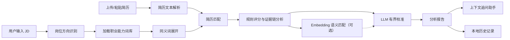

<p align="center">
  
</p>

<h1 align="center">BiasBreaker Career</h1>

<p align="center"><em>AI 求职反霸凌助手</em></p>

<p align="center">
  <a href="README.md">中文</a>
  ·
  <a href="README.en.md">English</a>
</p>

BiasBreaker Career 是一个**面向算法弱势求职者的 AI 求职反霸凌助手**。它关注的不是“把简历包装得更好看”，而是帮助大学生、转专业求职者、非名校背景求职者、经历表达不规范者等更容易被算法筛选误伤的人，看见招聘系统可能如何读取自己，并把真实经历转译成 ATS 与 HR 更容易理解的岗位语言。

在求职流程越来越依赖关键词检索、自动筛选和模型排序的背景下，很多候选人并不是能力不足，而是不知道算法在“看什么”。本项目希望把这种不透明的筛选压力拆解成可理解、可验证、可修改的证据链：用户输入目标岗位 JD，并上传或粘贴简历后，系统会从关键词覆盖、结构清晰度、经历证据和系统可读性等维度生成分析报告，同时提供可追问的上下文助手，帮助用户继续询问“先改哪里”“项目经历怎么写”“面试怎么解释”等问题。

项目定位不是替代 HR、承诺通过筛选，也不是制造迎合算法的虚假包装，而是帮助求职者识别潜在的算法误读、表达歧视和信息不对称风险，把已有经历更公平地呈现出来。

## 核心能力

- **面向算法弱势群体的求职风险解释**：把“为什么投递没回应”“为什么经历明明相关却不被识别”转化为可检查的关键词、结构和证据问题。
- **JD 驱动的岗位方向识别**：根据岗位标题、JD 关键词和能力描述，识别更接近的职业方向，减少候选人因岗位语言不熟悉而被动失分。
- **轻量中文校招职业能力词库**：内置运营、产品、技术、数据、市场、HR、设计、研究咨询等大学生高频方向能力词库，词库设计参考 O*NET、ESCO 与《中华人民共和国职业分类大典》的职业技能分类思路。
- **同义词展开与关键词覆盖分析**：把 JD 中的能力要求映射到词库和同义表达，降低只按字面匹配造成的误判。
- **证据链评分**：关注简历是否用项目、动作、方法、数据和结果支撑能力，而不只是堆关键词。
- **LLM 校准 + 规则兜底**：优先使用大模型对规则分析结果做有限幅度校准；模型不可用时仍可返回规则分析报告。
- **语义匹配信号**：可调用 embedding 模型计算 JD 与简历片段的语义相似度，辅助发现强证据和弱证据。
- **浏览器本地 PDF 解析**：PDF 通过 MuPDF Worker 在浏览器侧解析；DOCX、TXT、MD 通过服务端 API 提取文本。
- **报告追问助手**：在分析报告弹窗右侧提供上下文聊天框，基于当前 JD、简历文本和分析报告回答用户追问。
- **历史报告管理**：分析结果会保存在浏览器本地，可查看、筛选、删除和导出 Markdown 报告。
- **可选独立后端**：Next.js API 可直接完成分析，也可通过 `BACKEND_API_BASE_URL` 转发到 Fastify 后端，便于部署长耗时模型调用和任务队列。

## 快速开始

项目采用 npm workspaces 管理，前端是 Next.js 15 App Router，后端是可选 Fastify 服务。

```powershell
cd C:\Files\Study\Codes\Contest\Zhilian-Zhaopin-AI-Contest\BiasBreaker-Career
npm install
Copy-Item .env.example frontend\.env.local
npm run frontend:dev
```

启动后访问：

```text
http://localhost:3000
```

如果暂时没有配置模型 API Key，项目仍然可以运行。系统会跳过 LLM 或 embedding 调用，使用内置规则分析逻辑生成报告。

### 启用独立后端

默认情况下，前端的 Next.js API Routes 会直接执行分析。若希望把分析和聊天请求转发到独立 Fastify 后端，可以打开两个终端：

```powershell
# 终端 1：启动后端，默认 http://127.0.0.1:3001
Copy-Item backend\.env.example backend\.env
npm run backend:start
```

```powershell
# 终端 2：启动前端
Copy-Item .env.example frontend\.env.local
Add-Content frontend\.env.local "BACKEND_API_BASE_URL=http://127.0.0.1:3001"
npm run frontend:dev
```

前端配置 `BACKEND_API_BASE_URL` 后，`/api/analyze` 和 `/api/chat` 会以 307 重定向到后端对应接口。

## 环境变量

前端本地开发建议把根目录 `.env.example` 复制到 `frontend/.env.local`；独立后端部署时复制 `backend/.env.example` 到 `backend/.env`。

| 变量 | 使用位置 | 作用 |
| --- | --- | --- |
| `DEFAULT_LLM_PROVIDER` | 前端 / 后端 | LLM 提供方标识，默认示例为 `mimo` |
| `DEFAULT_LLM_MODEL` | 前端 / 后端 | 简历分析和追问助手使用的对话模型 |
| `MIMO_API_KEY` | 前端 / 后端 | LLM API Key |
| `MIMO_BASE_URL` | 前端 / 后端 | OpenAI-compatible LLM 接口地址，可填 base URL、`/v1` 或 `/chat/completions` |
| `DEFAULT_EMBEDDING_PROVIDER` | 前端 / 后端 | Embedding 提供方标识，默认示例为 `hunyuan` |
| `DEFAULT_EMBEDDING_MODEL` | 前端 / 后端 | 语义匹配使用的 embedding 模型 |
| `HUNYUAN_API_KEY` | 前端 / 后端 | Embedding API Key |
| `HUNYUAN_BASE_URL` | 前端 / 后端 | OpenAI-compatible embedding 接口地址，可填 base URL、`/v1` 或 `/embeddings` |
| `MODEL_TIMEOUT_SECONDS` | 前端 / 后端 | LLM 请求超时时间 |
| `EMBEDDING_TIMEOUT_SECONDS` | 前端 / 后端 | Embedding 请求超时时间 |
| `BACKEND_API_BASE_URL` | 前端 | 可选。配置后把分析和聊天 API 转发到独立后端 |
| `HOST` | 后端 | Fastify 监听地址，默认 `127.0.0.1` |
| `PORT` | 后端 | Fastify 监听端口，默认 `3001` |
| `ALLOWED_ORIGINS` | 后端 | CORS 白名单，逗号分隔 |
| `MAX_CONCURRENT_JOBS` | 后端 | 后端异步分析任务最大并发数 |

## 使用流程

1. 进入首页，点击开始分析。
2. 输入目标岗位名称和 JD 文本。
3. 上传 PDF、DOCX、TXT、MD 简历，或直接粘贴简历文本。
4. 点击分析，系统会先解析简历，再生成评分、风险说明、维度雷达图、优先处理问题、原句风险与改写建议。
5. 在报告右侧使用“分析追问助手”继续提问。
6. 在历史记录页查看过往报告，支持按姓名/岗位搜索、按风险等级筛选、批量删除和导出 Markdown 报告。

## 分析流程



说明：`规则评分与证据链分析 -> LLM 有界校准` 是主路径，因为规则分析会先产出稳定的基准报告；`Embedding 语义匹配` 是增强信号，用于辅助 LLM 判断 JD 与简历片段的语义接近度。这样设计的原因是 embedding 服务可能因为未配置 API Key、网络超时或模型不可用而失败，此时系统仍能基于规则分析和 LLM 校准继续返回报告；如果 embedding 可用，语义匹配结果会一并传入 LLM。

## 反霸凌分析维度

系统当前主要从四个维度拆解候选人可能面临的算法筛选风险：

| 维度 | 关注点 |
| --- | --- |
| 关键词覆盖 | 简历是否覆盖 JD 中的关键技能、工具、业务词和岗位能力要求，避免真实能力因表达不同而被漏检 |
| 结构清晰度 | 简历段落、项目描述、时间线和信息层级是否便于 ATS 与 HR 阅读，减少格式和层级带来的误伤 |
| 经历证据 | 是否有动作、方法、对象、结果和量化指标支撑能力表达，让非标准背景也能用证据证明能力 |
| 系统可读性 | 是否存在过度装饰、格式混乱、关键信息缺失等 ATS 读取风险 |

综合分并不是简单关键词命中率，而是结合岗位词库、同义词、风险标记、证据链和语义匹配信号形成的结果。

## 项目结构

```text
BiasBreaker-Career/
├── frontend/                         # Next.js 前端与默认 API Routes
│   ├── app/
│   │   ├── api/
│   │   │   ├── analyze/              # 简历分析 API，可转发到独立后端
│   │   │   ├── chat/                 # 报告追问助手 API，可转发到独立后端
│   │   │   └── parse-resume/         # DOCX/TXT/MD 简历解析 API
│   │   ├── analyze/                  # 简历分析页面
│   │   ├── history/                  # 历史记录页面
│   │   ├── page.tsx                  # 首页
│   │   └── globals.css               # 全局样式
│   ├── components/
│   │   ├── AnalysisResultModal.tsx   # 分析报告弹窗
│   │   ├── ResumeChatAssistant.tsx   # 右侧上下文追问助手
│   │   ├── DimensionRadar.tsx        # 维度雷达图
│   │   └── AppNav.tsx                # 应用导航
│   ├── data/                         # 职业能力词库与扩展词库
│   ├── lib/
│   │   ├── analysis.ts               # 规则评分、风险识别、建议生成
│   │   ├── lexicon.ts                # 词库加载、方向识别、同义词展开
│   │   ├── llm-analysis.ts           # LLM 分析校准
│   │   ├── semantic-analysis.ts      # Embedding 语义匹配
│   │   ├── model-provider.ts         # OpenAI-compatible 模型适配层
│   │   ├── history.ts                # 浏览器本地历史记录
│   │   └── pdf/parsePdfInBrowser.ts  # 浏览器 MuPDF 解析入口
│   └── workers/mupdf-parser.worker.ts
├── backend/
│   ├── index.ts                      # 可选 Fastify 分析后端
│   ├── ecosystem.config.cjs          # PM2 部署配置
│   └── package.json
├── docs/                             # 产品设计文档与比赛资料
├── package.json                      # npm workspaces 与根脚本
├── package-lock.json
└── README.md
```

## 主要 API

### `POST /api/parse-resume`

解析用户上传的 DOCX、TXT 或 MD 简历文件。

PDF 不走该接口，而是在浏览器中通过 MuPDF Worker 本地解析。这样可以减少 PDF 原文件上传到服务端的需求，也能避开部分服务端 PDF 解析依赖问题。

### `POST /api/analyze`

生成简历分析报告。

请求核心字段：

```json
{
  "jobTitle": "软件开发-后端开发方向",
  "jdText": "岗位 JD 文本",
  "resumeText": "简历文本",
  "resumeFileName": "resume.pdf"
}
```

处理逻辑：

1. 校验 JD 和简历文本。
2. 规范化岗位名称和输入文本。
3. 尝试生成语义匹配信号。
4. 尝试调用 LLM 做有界校准。
5. 如果模型调用失败，返回规则分析结果。

### `POST /api/chat`

用于分析报告右侧的追问助手。

请求核心字段：

```json
{
  "jobTitle": "目标岗位",
  "jdText": "JD 文本",
  "resumeText": "简历文本",
  "resumeFileName": "resume.pdf",
  "analysisResult": {},
  "messages": [
    { "role": "user", "content": "我最该先改哪三处？" }
  ]
}
```

助手只围绕当前 JD、简历和分析报告回答，不会编造经历、证书、学校、公司或项目成果。模型不可用时，会基于报告中的 findings、suggestions 和 reviewScripts 生成兜底回答。

### 独立后端额外接口

Fastify 后端除同步分析接口外，还提供异步任务接口，适合长耗时模型调用：

- `GET /health`：查看服务状态、队列长度和当前并发。
- `POST /api/analysis-jobs`：创建异步分析任务。
- `GET /api/analysis-jobs/:jobId`：查询任务状态和结果。

当前前端默认调用同步 `/api/analyze`，异步任务接口为后端扩展能力。

## 本地历史与隐私说明

历史记录保存在浏览器 `localStorage` 中，键名为：

```text
biasbreaker-career-history
```

每条历史记录包含：

- 分析报告
- 候选人名称推断结果
- 目标岗位
- 分析时间
- 原始 JD 文本
- 原始简历文本
- 简历文件名

PDF 文件在浏览器中通过 MuPDF Worker 解析，PDF 原文件不会上传到 `parse-resume` 接口；分析请求会发送提取后的文本、JD 和必要上下文。当前项目没有数据库，历史记录保存在用户本机浏览器；若部署到公开环境，需要进一步补充用户授权、数据加密、清除机制、日志脱敏和服务端存储策略。

## 技术栈

- **前端框架**：Next.js 15 App Router
- **语言**：TypeScript
- **UI**：React 19、Tailwind CSS v4、Framer Motion
- **文件解析**：浏览器 MuPDF Worker、`mammoth`
- **模型接口**：OpenAI-compatible Chat Completions 与 Embeddings
- **可选后端**：Fastify 5、`@fastify/cors`
- **数据存储**：浏览器 localStorage
- **部署配置**：Netlify Next.js 插件、PM2 后端配置

## 开发命令

根目录命令：

```powershell
npm run frontend:dev      # 启动前端开发服务器
npm run frontend:build    # 构建前端
npm run backend:start     # 启动可选 Fastify 后端
```

前端子目录命令：

```powershell
cd frontend
npm run dev
npm run build
npm run lint
```

后端子目录命令：

```powershell
cd backend
npm run dev
npm run start
```

## 常见问题

### 1. 没有模型 Key 可以体验吗？

可以。缺少模型配置时，LLM 分析和 embedding 语义匹配会失败并进入兜底逻辑，系统仍会用 `frontend/lib/analysis.ts` 中的规则机制生成报告。

### 2. PDF 解析效果不好怎么办？

PDF 由浏览器中的 MuPDF Worker 解析。若 PDF 是扫描件、加密文件、超过 10MB，或浏览器无法加载 Worker/WASM，系统可能无法提取文本。建议上传可复制文本的 PDF，或改用 DOCX/TXT/MD，也可以切换为粘贴文本模式。

### 3. `npm run frontend:dev` 或 `npm run frontend:build` 很久不结束怎么办？

Next.js 开发服务器本来会持续运行，不会自动退出。若 Windows 上出现 `.next/trace` 文件占用、构建卡住或端口被占用，可先停止当前项目相关的 Node 进程，再清理缓存：

```powershell
Get-CimInstance Win32_Process |
  Where-Object { $_.Name -match '^node(\.exe)?$' -and $_.CommandLine -like '*BiasBreaker-Career*' } |
  ForEach-Object { Stop-Process -Id $_.ProcessId -Force }

Remove-Item -LiteralPath frontend\.next -Recurse -Force -ErrorAction SilentlyContinue
npm run frontend:dev
```

### 4. 为什么报告追问助手有时回答比较保守？

这是有意设计。助手的系统提示要求它不能编造经历、数据、证书或项目成果。当简历中没有证据时，它会提示“当前简历中未体现”，并建议用户补充真实经历或用 `[待确认]` 标注。

### 5. 前端什么时候需要独立后端？

本地演示和轻量部署可以只使用 Next.js API Routes。若模型调用时间较长、希望控制并发、需要健康检查或想把服务端逻辑从 Netlify 函数中拆出来，可以部署 `backend/`，并在前端配置 `BACKEND_API_BASE_URL`。

## 适合的使用场景

- 大学生第一次面对 ATS、关键词筛选和岗位语言，不知道简历为什么“石沉大海”。
- 转专业、跨方向或非典型背景候选人，希望把已有经历翻译成目标岗位能识别的能力证据。
- 非名校、低资源或缺少职业辅导支持的求职者，需要一个能解释筛选逻辑的求职辅助工具。
- 投递前检查简历是否存在关键词漏检、证据不足、结构不清和系统读取风险。
- 准备面试时，把报告中的风险点转化为解释话术，避免被简历表述先入为主地误判。
- 比较不同岗位方向下，同一份简历的匹配差异，选择更合理的投递和修改策略。

## 设计边界

- 本项目不会承诺通过 ATS、笔试、面试或人工筛选。
- 本项目反对通过伪造经历、堆砌关键词或夸大成果来“欺骗算法”。
- 评分仅代表当前 JD 与当前简历文本之间的匹配、表达和系统读取风险。
- 建议应基于用户真实经历修改，不鼓励伪造项目、指标或证书。
- 当前历史记录为浏览器本地存储，不适合作为正式多用户生产环境的数据方案。

## 相关文档

- `docs/BiasBreaker_Career_产品设计文档.md`：产品设计与功能说明。
- `docs/智联招聘AI创新大赛参赛资料.docx`：比赛资料。
- `docs/superpowers/`：开发过程中的实现计划与设计记录。
