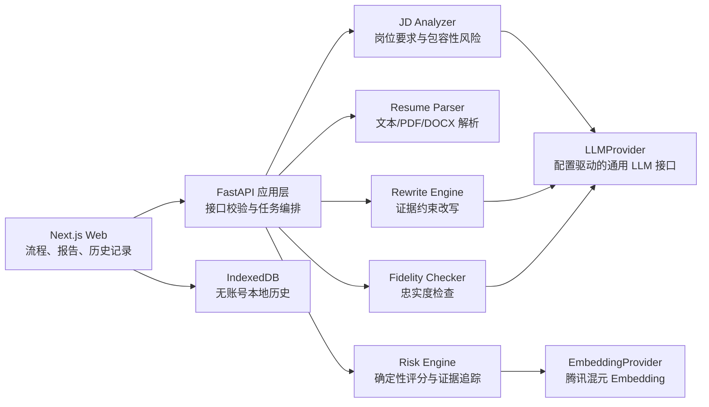
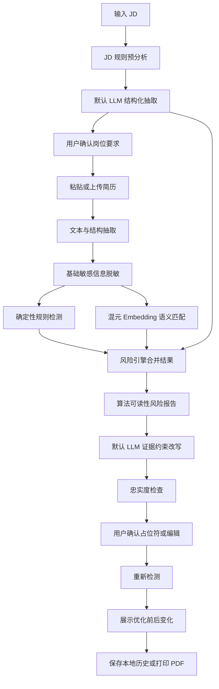

# BiasBreaker Career 实施设计文档

## 1. 文档目标

本文档定义 BiasBreaker Career 初赛 Web Demo 的实施边界、模块划分、技术架构、接口契约、核心算法、异常策略、测试验收与后续演进路径。

项目采用“竞赛优先双层方案”：

- 初赛层：完成稳定、真实、可解释的 P0 产品闭环。
- 演进层：保留向复赛及真实产品扩展的模块边界，不在初赛阶段提前实现复杂平台能力。

初赛核心闭环：

```text
输入岗位 JD 与简历
→ 识别算法可读性风险
→ 展示风险证据与来源
→ 生成证据约束改写
→ 完成忠实度检查
→ 修改后重新检测
→ 展示优化前后变化
→ 保存本地历史或导出报告
```

## 2. 已确认的产品决策

### 2.1 产品定位

- 参赛赛道：AI + 求职。
- P0 核心用户：普通大学生中的非典型经历求职者，包括校园项目、竞赛、科研、社团、公益及跨专业经历求职者。
- 特殊群体求职场景作为后续扩展能力，不作为初赛主叙事。
- 产品不预测真实 ATS 通过率，不判断企业歧视，不承诺提升录用率。

### 2.2 核心指标

产品主指标为“算法可读性风险模拟”，页面展示形式为“算法可读性：68/100”。

该指标用于提示求职材料被自动化系统理解的潜在风险，不代表企业真实筛选结果或录用概率。

包容性风险单独展示，不计入求职者算法可读性分数，避免让求职者为岗位自身的模糊表达承担扣分。

### 2.3 模型与部署

- 当前默认 LLM：真实 Mimo v2.5 Pro API。
- Embedding 主路径：腾讯混元 Embedding API。
- 模型访问分别通过统一 `LLMProvider` 与 `EmbeddingProvider` 抽象。
- 业务模块只依赖通用能力接口和内部数据模型，不依赖 Mimo 专属请求、响应或错误格式。
- 模型供应商、模型名称与能力参数通过配置选择，后续新增模型时无需修改领域业务代码。
- 部署形态：EdgeOne Pages 模块化单体全栈应用。
- 本地备份：使用 EdgeOne Pages 本地开发环境启动完整应用。
- 模型服务失败时采用显式降级，禁止将演示结果伪装为实时分析。

### 2.4 数据与历史

- 无账号体系。
- 服务端不持久化用户 JD、简历、报告、改写或上传文件。
- 历史记录保存于当前浏览器 IndexedDB。
- 历史记录不自动过期，支持单条删除与全部清空。
- 默认保存分析结果与改写结果；原始 JD 和简历文本仅在用户主动选择时保存。

## 3. 实施范围

### 3.1 P0 初赛必须完成

| 模块 | 核心能力 |
|---|---|
| 首页与流程引导 | 产品定位、示例内容填充、隐私说明、开始分析 |
| JD 分析 | 岗位要求抽取、关键词识别、包容性风险提示、用户确认 |
| 简历输入与解析 | 文本主路径、PDF/DOCX 抽取、有限格式风险检测 |
| 风险分析引擎 | 规则评分、混元语义匹配、证据追踪、风险指数 |
| 风险报告 | 子指标、风险等级、证据原句、来源标签 |
| 证据约束改写 | 三种改写版本、待确认占位符、改写理由 |
| 忠实度检查 | `passed`、`needs_confirmation`、`risky` |
| 修改后重检 | 编辑结果、重新评分、前后对比 |
| 话术生成 | 人工复核、补充说明、面试解释 |
| 本地历史 | IndexedDB 保存、查看、单条删除、全部清空 |
| 报告导出 | 打印专用页面、浏览器打印为 PDF |
| 显式降级 | 真实服务失败后，由用户主动加载标记明确的演示结果 |

### 3.2 P1 演进能力

- 视觉版式深度分析；
- 多岗位对比；
- 面试模拟训练；
- 无障碍便利申请专项流程；
- 自定义岗位词典；
- 分析报告分享；
- 更完整的无障碍模式；
- 云端账户与跨设备历史。

### 3.3 明确不做

- 登录注册与云端历史；
- 自动海投；
- 真实 ATS 通过概率预测；
- 企业歧视判定；
- 自动编造经历或数据；
- 服务端永久保存简历；
- 复杂在线简历排版编辑器；
- 独立 `/demo` 页面。

首页可以提供“填充示例内容”，但示例输入仍必须经过真实 API 分析。只有真实服务失败后，用户才可主动加载带醒目标识的演示结果。

## 4. 总体架构

系统采用模块化单体架构。Next.js 前端和 FastAPI Python Cloud Function 部署于同一 EdgeOne Pages 项目，后端内部按领域拆分模块。



### 4.1 架构原则

1. 确定性模块负责评分，生成式模型负责理解、解释与改写。
2. 任何 LLM 均不直接决定算法可读性总分。
3. 每项风险、评分与改写必须可追溯到 JD 或简历证据。
4. Provider 层隔离具体模型供应商。
5. 模型选择与能力参数由配置驱动，领域服务不得感知具体供应商。
6. 服务端保持无状态，业务历史仅保存在用户浏览器。
7. 优先完成可演示的纵向闭环，再扩展模块深度。

## 5. 前端模块划分

### 5.1 页面结构

```text
/                 首页
/analyze           JD 与简历分步输入
/report/[id]       风险报告与证据
/rewrite/[id]      改写、忠实度确认与重检
/history           本地历史
```

JD 与简历输入合并为同一个带步骤导航的 `/analyze` 页面，降低跨路由状态丢失风险。

### 5.2 前端业务模块

#### 首页模块

- 展示定位、核心价值、工作流程和免责声明；
- 提供“开始分析”与“填充示例内容”入口；
- 示例内容只填充输入，不直接返回预设报告。

#### 分析向导模块

- 第一步：输入 JD 并运行解析；
- 第二步：用户确认或修正岗位要求；
- 第三步：粘贴或上传简历；
- 第四步：预览脱敏结果并提交完整分析；
- 保留输入状态，API 失败后不得清空。

#### 风险报告模块

- 展示算法可读性总分及四项子指标；
- 分开展示求职材料风险与岗位包容性风险；
- 风险项展示严重程度、来源类型、置信度、原始证据与建议动作；
- 明确提示结果不是企业真实 ATS 结论。

#### 改写与重检模块

- 展示原句、改写版本、证据引用与改写理由；
- 支持填写待确认占位符；
- 展示忠实度状态；
- `risky` 状态禁止复制；
- 用户编辑完成后重新检测，并展示优化前后变化。

#### 历史模块

- 使用 IndexedDB 保存用户主动选择保存的分析；
- 同一记录可保存多个重检版本；
- 支持查看、单条删除、全部清空；
- 明确提示历史仅保存在当前浏览器。

#### 打印导出模块

- 使用浏览器打印功能导出 PDF；
- 提供打印专用样式；
- 打印内容包含风险指数、证据、改写建议和复核话术；
- 不打印交互按钮；
- 原始简历与未确认占位符默认不进入报告。

## 6. 后端模块划分

### 6.1 FastAPI 应用层

职责：

- 请求校验；
- 调用领域服务完成任务编排；
- 生成请求 ID；
- 统一错误响应；
- 不实现具体评分或模型业务规则。

### 6.2 JD Analyzer

职责：

- 通过规则词典预识别岗位关键词与模糊要求；
- 通过 `LLMProvider` 使用当前默认 LLM 完成结构化岗位要求抽取；
- 识别硬性要求、软性要求、加分项和 ATS 关键词；
- 识别岗位包容性风险；
- 保存每项结果对应的 JD 原句证据；
- 允许用户确认或修正结果。

包容性风险只表达潜在影响与建议澄清问题，不判断企业存在歧视。

### 6.3 Resume Parser

输入支持：

- 粘贴纯文本；
- PDF；
- DOCX。

职责：

- 抽取纯文本；
- 识别教育、经历、技能、时间等基础结构；
- 生成带偏移量的证据片段；
- 检测抽取为空、文本过少、联系方式或标题缺失、时间信息缺失等可靠问题；
- 对 PDF 检测图片化或文本块顺序异常等有限风险。

模块不宣称准确识别所有双栏、表格或视觉排版问题。无法解析时引导用户切换为粘贴文本。

### 6.4 Risk Engine

职责：

- 计算关键词覆盖；
- 通过混元 Embedding 计算语义证据匹配；
- 检查经历证据完整度；
- 计算结构可读性；
- 生成风险标签；
- 合并结果并输出可复现的算法可读性分数；
- 为所有风险关联原始证据。

### 6.5 Rewrite Engine

职责：

- 基于风险项、原始证据和岗位要求调用 `LLMProvider`；
- 生成保守真实版、ATS 友好版和 HR 可读版；
- 为每条改写关联证据；
- 识别可以增强说服力但原文缺失的信息；
- 使用待确认占位符表达缺失信息，不允许模型自行补充事实或数字；
- 生成人工复核、补充说明和面试解释话术。

### 6.6 Fidelity Checker

职责：

- 检查改写内容是否超出原始证据；
- 检查占位符是否已由用户确认；
- 输出忠实度状态；
- 为不支持的新事实生成风险说明；
- 控制内容是否允许直接复制。

状态定义：

- `passed`：所有事实均有原始证据或已由用户确认；
- `needs_confirmation`：存在尚未确认的占位符；
- `risky`：存在无法支持的新事实，禁止直接复制。

### 6.7 Provider 层

业务层通过模型无关的能力接口访问 LLM 与 Embedding 服务。当前默认适配器为 Mimo v2.5 Pro 和腾讯混元 Embedding，后续可以增加其他供应商适配器。

统一模型接口：

```python
class LLMProvider(Protocol):
    async def generate_structured(
        request: StructuredGenerationRequest,
        response_model: type[BaseModel],
    ) -> BaseModel: ...


class EmbeddingProvider(Protocol):
    async def embed(self, request: EmbeddingRequest) -> EmbeddingResult: ...
```

Provider 层统一处理：

- 鉴权；
- 超时；
- 有限重试；
- 结构化输出校验；
- 错误映射；
- 调用元数据；
- 供应商请求与响应格式转换；
- 供应商替换。

通用请求模型只表达业务所需能力，不暴露供应商专属字段：

```python
class StructuredGenerationRequest(BaseModel):
    task: str
    system_prompt: str
    user_payload: dict
    temperature: float = 0.2
    max_output_tokens: int | None = None
    metadata: dict[str, str] = {}


class EmbeddingRequest(BaseModel):
    texts: list[str]
    purpose: str
    metadata: dict[str, str] = {}
```

模型实例由配置和工厂创建：

```python
llm_provider = ProviderFactory.create_llm(settings.default_llm_provider)
embedding_provider = ProviderFactory.create_embedding(
    settings.default_embedding_provider
)
```

新增模型接入步骤：

1. 实现 `LLMProvider` 或 `EmbeddingProvider`；
2. 将供应商异常映射为统一领域错误；
3. 在 Provider Registry 中注册适配器；
4. 增加环境变量与配置；
5. 通过 Provider 契约测试；
6. 不修改 JD 分析、风险检测、改写或忠实度业务代码。

建议环境变量：

```env
DEFAULT_LLM_PROVIDER=mimo
DEFAULT_LLM_MODEL=mimo-v2.5-pro
DEFAULT_EMBEDDING_PROVIDER=hunyuan
DEFAULT_EMBEDDING_MODEL=your-hunyuan-embedding-model

MIMO_API_KEY=
MIMO_BASE_URL=
HUNYUAN_API_KEY=
HUNYUAN_BASE_URL=
```

## 7. 核心数据流



关键约束：

- JD 解析结果必须经过用户确认后，才能进入完整风险分析。
- 每项结论标记来源为 `rule`、`embedding` 或 `llm`。
- 风险项必须引用 JD 或简历证据 ID。
- 同一输入、规则版本和 Embedding 模型版本下，核心分数应保持一致。
- 重检结果保存为同一历史记录的新版本。

## 8. 算法可读性风险指数

### 8.1 指标结构

```text
算法可读性 =
关键词覆盖 30%
+ 语义证据匹配 25%
+ 经历证据完整度 30%
+ 结构可读性 15%
```

各子分取值范围均为 0 到 100。

```python
readability_score = round(
    keyword_coverage * 0.30
    + semantic_evidence * 0.25
    + evidence_completeness * 0.30
    + structure_readability * 0.15
)
```

### 8.2 关键词覆盖

- 使用 JD 确认后的关键词列表；
- 支持精确词、标准化词和受控同义词；
- 按关键词重要程度加权；
- 输出命中词、缺失词和对应证据。

### 8.3 语义证据匹配

- 将岗位要求句与简历经历句分别调用混元 Embedding；
- 计算余弦相似度；
- 每项岗位要求保留最高匹配经历及相似度；
- 阈值、模型标识和算法版本写入结果元数据；
- Embedding 不可用时，经用户确认后降级为关键词与同义词匹配。

### 8.4 经历证据完整度

按每条经历是否包含以下证据维度进行评分：

- 行动；
- 对象或场景；
- 方法或工具；
- 输出或结果。

缺少数据时只提示可补充项，不推断或编造数字。

### 8.5 结构可读性

只计算系统能够可靠判断的问题，包括：

- 文本是否可抽取；
- 文本量是否明显不足；
- 是否缺少经历标题、技能区或时间信息；
- 是否存在明显图片化 PDF；
- 是否存在明显文本块读取顺序异常。

### 8.6 版本与复现

分析结果必须保存：

```json
{
  "rule_version": "1.0.0",
  "prompt_version": "1.0.0",
  "llm_provider": "mimo",
  "llm_model": "mimo-v2.5-pro",
  "embedding_provider": "hunyuan",
  "embedding_model": "configured-model-id"
}
```

## 9. API 设计

### 9.1 接口列表

```text
POST /api/jobs/analyze
POST /api/resumes/parse-text
POST /api/resumes/parse-file
POST /api/analyses/run
POST /api/rewrites/generate
POST /api/rewrites/check-fidelity
POST /api/analyses/recheck
GET  /api/health
```

### 9.2 分步接口原则

- JD 分析与完整风险分析分开；
- 用户确认 JD 结果后，再调用 `/api/analyses/run`；
- 改写生成、忠实度检查与重检分开；
- 失败时保留前端已有状态；
- 不在服务端保存分析 ID 对应的业务数据，`analysis_id` 由客户端生成并用于本地关联。

### 9.3 核心分析响应

```json
{
  "analysis_id": "client-generated-uuid",
  "readability_score": 68,
  "dimensions": {
    "keyword_coverage": 62,
    "semantic_evidence": 74,
    "evidence_completeness": 55,
    "structure_readability": 86
  },
  "risks": [
    {
      "type": "missing_keyword",
      "severity": "high",
      "title": "岗位关键词表达不足",
      "explanation": "已有相关经历，但未使用岗位可识别的表达。",
      "source": "rule",
      "confidence": 0.92,
      "jd_evidence_ids": ["jd-3"],
      "resume_evidence_ids": ["resume-7"],
      "suggested_action": "补充真实、岗位相关的能力表达。"
    }
  ],
  "inclusivity_risks": [],
  "metadata": {
    "rule_version": "1.0.0",
    "prompt_version": "1.0.0",
    "llm_provider": "mimo",
    "llm_model": "mimo-v2.5-pro",
    "embedding_provider": "hunyuan",
    "embedding_model": "configured-model-id"
  }
}
```

### 9.4 证据模型

```json
{
  "id": "resume-7",
  "source": "resume",
  "text": "负责小红书内容整理，协助收集同学反馈。",
  "section": "校园项目",
  "start_offset": 128,
  "end_offset": 151
}
```

### 9.5 改写与忠实度模型

```json
{
  "rewrite_id": "rewrite-1",
  "original_evidence_ids": ["resume-7"],
  "ats_friendly_version": "参与小红书内容运营，整理内容素材并收集用户反馈。",
  "placeholders": [
    {
      "key": "feedback_count",
      "label": "反馈人数",
      "required": false,
      "confirmed_value": null
    }
  ],
  "fidelity": {
    "status": "needs_confirmation",
    "unsupported_claims": [],
    "pending_placeholders": ["feedback_count"]
  }
}
```

### 9.6 统一错误模型

```json
{
  "error": {
    "code": "LLM_TIMEOUT",
    "message": "AI 分析服务响应超时，请稍后重试。",
    "retryable": true,
    "request_id": "req_xxx"
  }
}
```

## 10. 推荐项目结构

```text
biasbreaker-career/
├── app/                         # Next.js 页面
├── components/                  # 通用 UI 与业务组件
├── features/                    # analyze/report/rewrite/history
├── lib/                         # API、IndexedDB、类型、工具
├── cloud-functions/
│   ├── api/
│   │   └── index.py             # FastAPI 入口
│   ├── app/
│   │   ├── routers/             # HTTP 接口
│   │   ├── schemas/             # 请求响应模型
│   │   ├── services/            # 应用编排
│   │   ├── domain/              # 评分、风险、忠实度规则
│   │   ├── providers/           # 通用接口、工厂、Registry 与供应商适配器
│   │   ├── parsers/             # 文本、PDF、DOCX
│   │   └── data/                # 词典与规则版本
│   └── requirements.txt
├── tests/
├── docs/
└── edgeone.json
```

## 11. 技术栈

### 11.1 前端

- Next.js；
- React；
- TypeScript；
- Tailwind CSS；
- shadcn/ui；
- ECharts；
- Zustand；
- TanStack Query；
- Dexie.js。

### 11.2 后端

- Python 3.10；
- FastAPI；
- Pydantic；
- httpx；
- PyMuPDF；
- python-docx。

### 11.3 模型

- 默认 LLM：Mimo v2.5 Pro；
- 默认 Embedding：腾讯混元 Embedding；
- 通用 Provider 接口、配置驱动模型选择与供应商适配器；
- 规则词典与受控同义词表。

## 12. EdgeOne Pages 适配

- Next.js 与 FastAPI Cloud Function 部署于同一项目；
- FastAPI 入口放置于 `cloud-functions/api/index.py`；
- 前端通过同域 `/api/*` 调用后端；
- API Key 只保存在 EdgeOne 环境变量；
- 上传文件只在请求生命周期内处理；
- Python 运行时为 3.10；
- 单次请求体受平台 6 MB 上限约束；
- Python 函数代码与依赖包受 128 MB 上限约束；
- 单次函数最长执行时间为 120 秒；
- 云函数本地文件不可用于持久化；
- 本地开发使用 `edgeone pages dev` 启动完整应用。

产品不设计用户额度与复杂限流，但必须正确处理平台约束、模型超时和重复提交。

## 13. 隐私设计

### 13.1 服务端

- 不持久化 JD、简历、报告、模型响应或上传文件；
- 请求结束后释放上传文件与中间数据；
- 日志不记录请求正文与模型完整响应；
- 日志只记录请求 ID、耗时、状态、错误类型和必要调用元数据。

### 13.2 模型调用

- 调用第三方模型前默认脱敏姓名、电话、邮箱、住址和身份证号；
- 用户可以预览脱敏后的模型输入；
- 脱敏不应破坏经历内容、岗位关键词或评分证据；
- API Key 不进入前端代码或浏览器存储。

### 13.3 本地历史

- 使用 IndexedDB；
- 不自动过期；
- 支持单条删除与全部清空；
- 默认不保存原始 JD 和简历；
- 用户主动选择后才保存原始输入；
- 明确提示清理浏览器数据后历史无法恢复。

## 14. 异常与降级策略

| 场景 | 系统行为 |
|---|---|
| LLM 或 Embedding 服务超时 | 显示重试入口，保留用户已填写内容 |
| Embedding 不可用 | 经用户确认后降级为关键词与同义词检测 |
| LLM 输出结构错误 | 自动修复重试一次，失败后明确报错 |
| 上传文件无法解析 | 引导用户切换为粘贴文本 |
| 模型调用整体失败 | 用户可主动加载带醒目标识的演示结果 |
| 重检失败 | 保留修改稿和旧报告，不覆盖历史版本 |
| 重复提交 | 前端禁用重复操作并复用当前任务状态 |

禁止静默使用 Mock 或演示数据替代真实模型结果。

## 15. 伦理与可信度控制

- 风险指数明确标注为投递前风险模拟；
- 不声称能够复刻或破解企业 ATS；
- 包容性风险不判断企业歧视；
- 包容性风险不计入求职者分数；
- 任何 LLM 均不参与决定总分；
- 无证据事实不得进入可复制内容；
- `risky` 状态禁用复制；
- AI 解释标记来源；
- 演示结果醒目标记；
- 不承诺提升录用率；
- 不鼓励用户隐藏、伪造或夸大经历。

## 16. 测试与验收

### 16.1 测试分层

- 单元测试：评分公式、关键词匹配、证据完整度、忠实度状态、脱敏规则；
- Provider 契约测试：使用统一测试套件验证 Mimo、混元及后续适配器；
- Provider 替换测试：切换配置后，领域服务与 API 响应结构保持不变；
- 解析测试：中文文本、正常 PDF、图片型 PDF、DOCX、空文件和异常文件；
- API 集成测试：覆盖 JD 分析、风险检测、改写、忠实度检查和重检；
- 前端流程测试：示例填充、真实分析、错误重试、历史删除和打印导出；
- 部署冒烟测试：EdgeOne 线上版本与本地备份各完成一次完整闭环。

### 16.2 固定评测样例

至少准备以下 6 组人工标注样例：

1. 校园项目表达过于笼统；
2. 跨专业但具备可迁移能力；
3. 关键词缺失但语义相关；
4. 证据充分、无需过度改写；
5. 图片型 PDF 或结构异常简历；
6. 包含模糊岗位要求的 JD。

每组定义预期风险、证据关联和合理分数区间，用于规则回归验证。

### 16.3 P0 验收标准

- 示例输入与真实输入均可完成完整闭环；
- 同一输入和规则版本下核心评分保持一致；
- 每个高风险项均能回指至少一条原始证据；
- 任何 LLM 均不可直接改变风险总分；
- 无证据数据不会出现在可直接复制的改写中；
- 修改后重检可展示前后指标变化；
- 历史记录刷新页面后仍存在，并可删除；
- 打印 PDF 内容完整，不包含交互按钮和敏感原文；
- 第三方 API 失败时不会丢失用户输入；
- EdgeOne 线上版本和本地备份均可完成演示。

## 17. 实施阶段与完成门槛

实施文档不绑定具体日期。开发按依赖关系分为三个阶段。

### 17.1 阶段一：核心分析纵向闭环

```text
输入 JD 与简历
→ 默认 LLM 结构化解析
→ 混元语义匹配
→ 规则评分
→ 输出风险指数与证据
```

完成门槛：固定样例可通过真实 API 稳定生成可解释报告。

### 17.2 阶段二：反误读优化闭环

```text
风险报告
→ 证据约束改写
→ 待确认占位符
→ 忠实度检查
→ 编辑后重检
→ 前后指标对比
```

完成门槛：无证据内容不可直接复制，修改后能够展示指标变化。

### 17.3 阶段三：产品化与可靠性

- 本地历史记录；
- PDF/DOCX 上传；
- 隐私脱敏；
- 错误恢复与显式演示降级；
- 打印导出；
- EdgeOne 部署与本地备份；
- UI 设计图适配。

完成门槛：线上与本地均可完成完整演示流程。

### 17.4 实施顺序原则

- 优先完成纵向闭环，再扩充每个模块；
- 先使用固定样例验证接口，再接 UI；
- 先保证文本输入，之后增加文件上传；
- 先实现规则评分，再接 Embedding；
- 每完成一个阶段立即执行冒烟测试；
- 新功能不得破坏已完成的主流程。

## 18. 演示与交付

### 18.1 演示主线

```text
真实示例输入
→ 发现“能力存在但表达未被识别”
→ 查看证据与风险来源
→ 使用证据约束改写
→ 确认待补充事实
→ 修改后重检
→ 风险指数与子指标改善
→ 导出报告或生成人工复核话术
```

### 18.2 最终交付物

- EdgeOne Pages 在线 Demo；
- 本地一键启动版本；
- 项目源代码与 README；
- 实施设计文档；
- 作品说明 PDF；
- 3-5 分钟演示视频；
- 技术架构图与产品流程图；
- 固定演示 JD、简历及评测样例；
- 原创声明与授权材料。
